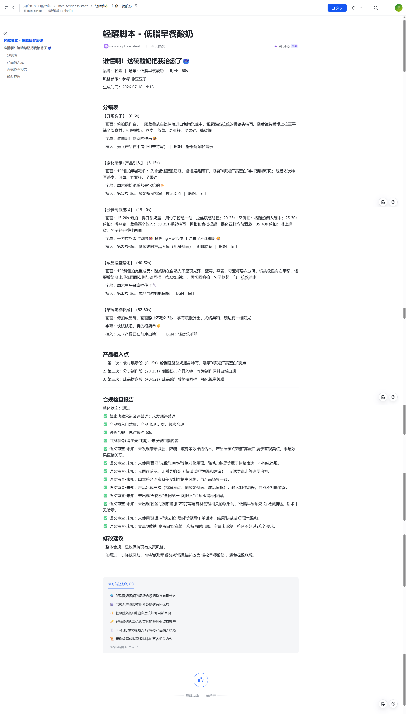
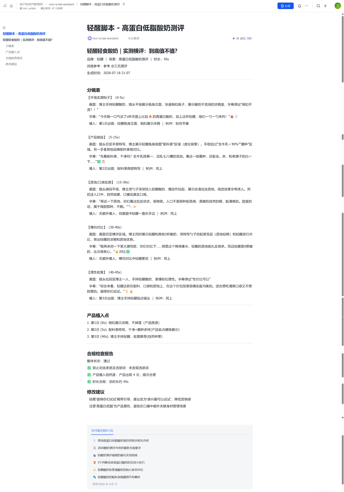

# MCN 脚本生成助手 Agent

基于小红书博主调研报告，使用 **LangGraph StateGraph** 构建的 5 步 AI Agent 工作流，自动生成符合博主调性的商单短视频脚本，并自动写入飞书文档。

**AI Agent 解决方案实习生 - 实操测试题（AOI 部门 | MCN AI 业务方向）**

---

## 测试题要求对照

| 要求 | 状态 | 位置 |
|------|------|------|
| **A1** 10 位小红书博主调研 | ✅ | [final_report.md](final_report.md) A1 |
| **A2** AI 工作流与 Skill 设计 | ✅ | [final_report.md](final_report.md) A2 + [SKILL.md](skills/mcn-script-assistant/SKILL.md) |
| **A3** 选定博主 + 内容拆解 | ✅ | [final_report.md](final_report.md) A3 — @豆豆子 |
| **B1** 4-6 步流程 Agent | ✅ | LangGraph 5 节点 + 迭代闭环 |
| **B2** 核心 Prompt + 输入输出 | ✅ | [SKILL.md](skills/mcn-script-assistant/SKILL.md) |
| **B3** 可复用 Skill | ✅ | [SKILL.md](skills/mcn-script-assistant/SKILL.md) |
| **C1** 符合博主风格脚本 | ✅ | [output/](output/) |
| **C2** 标题 + 分镜 + 合规 | ✅ | 完整分镜表 + 检查报告 |
| **C3** 飞书文档自动写入 | ✅ | 自动化写入指定文件夹 |
| **README** 完整说明 | ✅ | 本文档 |

---

## 项目结构

```
MCN/
├── .env                          # API 密钥和飞书凭证
├── .env.example                  # 环境变量模板
├── final_report.md               # 小红书博主调研报告（A1 + A2 + A3）
├── run_agent.py                  # 运行入口
├── README.md                     # 本文档
├── requirements.txt              # Python 依赖
│
├── agent/                        # LangGraph Agent 核心
│   ├── mcn_agent.py              # StateGraph 定义 + 5 节点 + 条件边
│   ├── models.py                 # 数据模型（BriefInfo/StyleProfile/Script）
│   ├── config.py                 # 配置（FORBIDDEN_WORDS/CAUTION_WORDS/API）
│   ├── llm.py                    # LLM 抽象层（retry/Token追踪/Demo降级）
│   └── steps/
│       ├── brief_parser.py       # Step 1: Brief 解析
│       ├── style_analyzer.py     # Step 2: 风格分析
│       ├── script_generator.py   # Step 3: 脚本生成（3 套分镜模板）
│       ├── risk_checker.py       # Step 4: 双层合规检查 + 迭代修复
│       └── feishu_writer.py      # Step 5: 飞书文档自动写入
│
├── skills/
│   └── mcn-script-assistant/
│       └── SKILL.md              # 可复用 Skill 定义
│
└── output/                       # 脚本输出目录
    └── script_*.md               # 生成的脚本
```

---

## LangGraph 架构

```
                    START
                      │
          ┌───────────┼───────────┐
          ▼           │           ▼
    parse_brief       │    analyze_style     ← 并行执行
          └───────────┼───────────┘
                      ▼
              generate_script
              (3 套模板动态选择)
                      │
                      ▼
              check_compliance
              (规则层 + LLM 语义层)
                      │
              ┌───────┴───────┐
              │               │
         [PASS]           [FAIL]
              │               │
              ▼               ▼
        write_output    fix_script
        (飞书+本地)      (迭代修复)
              │               │
              ▼               ▼
            [END]      check_compliance
                         (再检查·最多 5 次)
```

---

## 快速开始

### 1. 配置环境
```bash
conda activate langchain
cd MCN/
pip install -r requirements.txt
```

### 2. 配置 API Key
复制 `.env.example` 为 `.env`，填入：
```bash
LLM_API_KEY=sk-xxx
LLM_API_BASE=https://api.deepseek.com
LLM_MODEL=deepseek-chat
FEISHU_APP_ID=xxx       # 可选
FEISHU_APP_SECRET=xxx   # 可选
```

### 3. 运行 Agent
```bash
# 默认场景（豆豆子 + 轻醒）
python run_agent.py

# 指定场景
python run_agent.py --scene "办公室下午茶"

# 自定义品牌和博主类型
python run_agent.py --scene "无糖咖啡测评" --brief "品牌：瑞幸" --style "博主：三无测评。内容类型：产品测评。时长：35-45s"
```

---

## 飞书文档接入（自动化写入）

Agent 使用飞书开放 API v2 自动创建文档并写入内容，**全程无需手动操作**。

### 配置步骤
1. 在 [飞书开发者后台](https://open.feishu.cn/app) 创建企业自建应用
2. 获取 App ID 和 App Secret
3. **权限管理** → 添加 `docx:document` 权限
4. **安全设置** → 关闭 IP 白名单（或添加出口 IP）
5. **版本管理与发布** → 创建版本 → 发布应用
6. 在 `.env` 中配置 `FEISHU_APP_ID` 和 `FEISHU_APP_SECRET`

### 自动化写入流程
```python
1. POST /auth/v3/tenant_access_token/internal        → 获取 token
2. POST /docx/v1/documents                            → 创建文档
3. GET  /docx/v1/documents/{doc_id}/blocks            → 获取文档根块 ID
4. POST /docx/v1/documents/{doc_id}/blocks/{root_id}/children → 分块写入
```

### 最终脚本
面试官可在以下链接查看自动生成的脚本：  
[https://xcnxsm9mgjbj.feishu.cn/wiki/QDrkwd9fIiezMwkjaUncNJaAnyg](https://xcnxsm9mgjbj.feishu.cn/wiki/QDrkwd9fIiezMwkjaUncNJaAnyg?from=from_copylink)

### 运行效果
```
[FEISHU] 文档已创建: https://bytedance.feishu.cn/docx/xxx
[FEISHU] 内容写入成功
```

### 降级策略
未配置飞书或 API 调用失败时，自动保存到本地：
```
[FILE] 脚本已保存到: output/script_20260718_xxx.md
```

---

## 使用的 AI 工具

| 工具 | 用途 |
|------|------|
| **DeepSeek API** (`deepseek-v4-flash`) | LLM 调用（Brief 解析/风格分析/脚本生成/语义检查） |
| **LangGraph** | Agent 工作流编排（StateGraph/条件边/状态管理） |
| **飞书开放 API** | 文档自动创建与写入 |
| **Claude Code** |	项目代码编写、逻辑调试、脚本优化、工程化代码生成 |
---

## 运行效果截图

| 豆豆子风格（美食制作） | 三无测评风格（产品测评） |
|---------|---------|
|  |  |

## 运行数据

```
单次运行（4 次 LLM 调用）:
  ├─ brief_parser     ~800 tokens
  ├─ style_analyzer   ~800 tokens
  ├─ generate_script  ~3,500 tokens
  └─ check_compliance ~1,500 tokens
  Total: ~7,500 tokens | ~$0.005 (DeepSeek)
```
